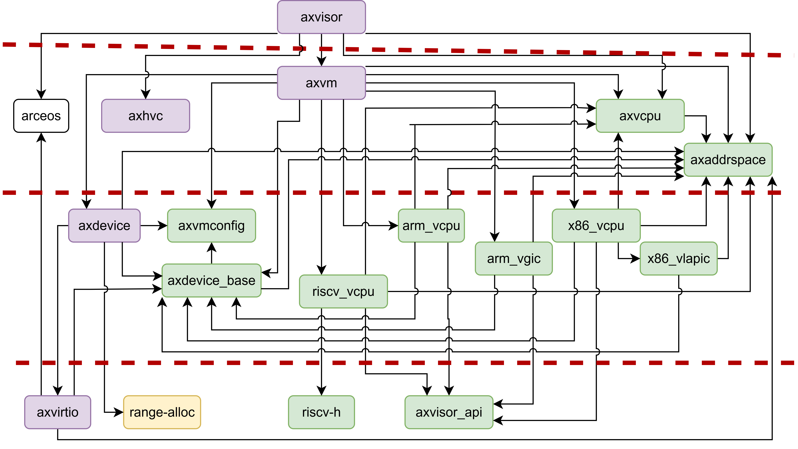

# axvisor-crates

Reusable crates list for [AxVisor](https://github.com/arceos-hypervisor/axvisor).

## Crate List

| Crate | &nbsp;&nbsp;&nbsp;&nbsp;&nbsp;crates.io&nbsp;&nbsp;&nbsp;&nbsp;&nbsp; | Documentation | Description |
|----|---|:--:|----|
| [arm_gicv2](https://github.com/arceos-hypervisor/arm_gicv2) |  |  | ARM Generic Interrupt Controller version 2 (GICv2) register definitions and basic operations. |
| [arm_vcpu](https://github.com/arceos-hypervisor/arm_vcpu) |  |  | Aarch64 VCPU implementation for Arceos Hypervisor. |
| [arm_vgic](https://github.com/arceos-hypervisor/arm_vgic) |  |  | ARM Virtual Generic Interrupt Controller (VGIC) implementation.. |
| [axaddrspace](https://github.com/arceos-hypervisor/axaddrspace) |  |  | ArceOS-Hypervisor guest address space management module. |
| [axdevice_base](https://github.com/arceos-hypervisor/axdevice_base) |  |  | Basic traits and structures for emulated devices in ArceOS hypervisor.. |
| [axvcpu](https://github.com/arceos-hypervisor/axvcpu) |  |  | Virtual CPU abstraction for ArceOS hypervisor. |
| [axvirtio-common](https://github.com/arceos-hypervisor/axvirtio-devices/tree/main/axvirtio-common/) |  |  | Common types, traits, and utilities for VirtIO device implementations. |
| [axvirtio-blk](https://github.com/arceos-hypervisor/axvirtio-devices/tree/main/axvirtio-blk/) |  |  | VirtIO block device implementation with MMIO transport for hypervisors. |
| [axvisor_api](https://github.com/arceos-hypervisor/axvisor_api) |  |  | Basic API for components of the Hypervisor on ArceOS. |
| [axvm](https://github.com/arceos-hypervisor/axvm) | N/A |  | null. |
| [axvmconfig](https://github.com/arceos-hypervisor/axvmconfig) |  |  | A simple VM configuration tool for ArceOS-Hypervisor.. |
| [riscv-h](https://github.com/arceos-hypervisor/riscv-h) |  |  | RISC-V virtualization-related registers. |
| [riscv_vcpu](https://github.com/arceos-hypervisor/riscv_vcpu) |  |  | ArceOS-Hypervisor riscv vcpu module. |
| [x86_vcpu](https://github.com/arceos-hypervisor/x86_vcpu) |  |  | x86 Virtual CPU implementation for the Arceos Hypervisor. |
| [x86_vlapic](https://github.com/arceos-hypervisor/x86_vlapic) |  |  | x86 Virtual Local APIC. |

## Crate Dependency

